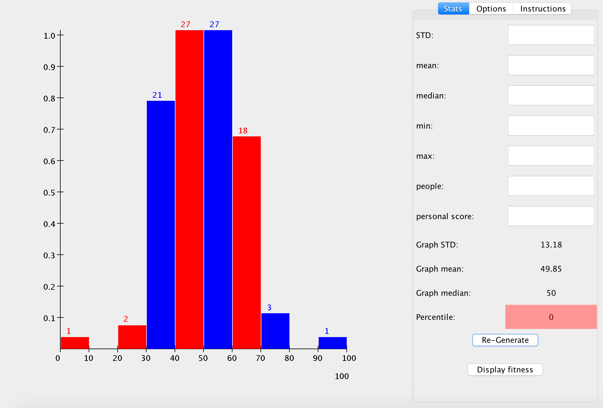
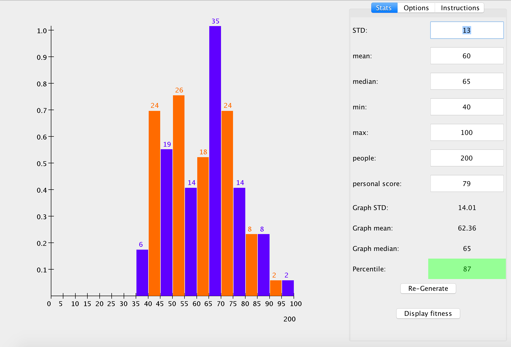

<h1> Gradebook  </h1>

Welcome to Gradebook!

This is a percentile finder for students. Simply enter exam statistics to find where you place in the class!

<h2> Installation </h2>
Download the Gradebook.jar file from the repository itself or clone the repository and run the jar file to start the program. 

<h2> Troubleshooting </h2>
If the jar file doesn't run, make sure that you have JDK 8 or JRE 8 installed. If the program still doesn't run, navigate to the source directory of the jar using terminal and enter java -jar Gradebook.jar to run.

<h2> Usage </h2>
Below are basic instructions for using Gradebook:

<h4> Stats Page </h4>
Here you can enter information about Standard Deviation, Mean, Median, etc. If you leave any text field blank the value of that statistic resolves to the default value. Below are the default values for each statistic:

Standard deviation: 10  
Mean: 50  
Median: 50  
Min: 0  
Max: 0  
People: 100  
Personal Score: 0  

The user can generate a new histogram by clicking on the Re-generate button. Clicking on the Re-generate button subsequently will generate new histograms. It's possible that percentile scores change after susequent clicks. Clicking on the display fitness button will display the fitness of the graph over time as the genetic algorithm progresses through generations.

<h4> Options Page </h4>
It's also possible to change the settings of the graph. You can change the spacing between ticks on the x axis in addition to changing the number of ticks on the y axis and the maximum frequency. You must click on the "Update" button to view changes. Towards the bottom of the panel, you can change the bar colors on the histogram by clicking on the bar color you wish to change and then sliding the RGB sliders to the appropriate color. It's not necessary to click on "Update" after changing the color.

<h4> Instructions Page </h4>
If you wish to refer to the manual please click on this tab.

<h2> Versions </h2>
Version 1.1 (11/6/16) Released Gradebook. The main panel in the program presents the visual for the histogram. All the ticks are labelled and frequency of the scores are labelled above each histogram bar. The right panel supports user interactions. The first tabbed pane supports basic statistics manipulations. The user can update the histogram by pressing the Re-generate button and the user can display the fitness of the graph by clicking on the Display Fitness button. After a histogram is generated, basic statistics of the graph is shown on the panel. In the second tabbed pane, the user can alter the metrics of the graph (such as x spacing and number of y ticks) and the user can change the color of the histogram using color sliders. The final tabbed pane brings the user to the instructions page. 
